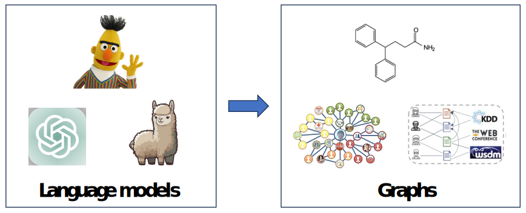

# Awesome-Language-Model-on-Graphs 
A curated list of papers and resources about language model on graphs.

    

## Contents
- [Awesome-LM-on-Graphs](#awesome-language-model-on-graphs)
  - [Contents](#contents)
  - [Datasets](#datasets)
  - [Basic](#basic)
  - [Representation Learning](#representation-learning)
  - [Pretraining](#pretraining)
  - [Node Classification](#node-classification)
  - [Graph Classification](#graph-classification)
  - [Language Modeling](#language-modeling)
  - [Question Answering](#question-answering)
  - [Text Generation](#text-generation)
  - [Graph As Tools](#graph-as-tools)
  - [Model Efficiency](#model-efficiency)
  - [Contribution](#contribution)

### Keywords Convention

 The transformer architecture used in the work, e.g., EncoderOnly, DecoderOnly, EncoderDecoder.

 The size of the language model, e.g., medium, LLM.

## Datasets
### Text-attributed network
- Microsoft Academic network (MAG)
 Networks from 19 domains including CS, Mathematics, Geology, etc.
 [[PDF](https://arxiv.org/abs/2302.03341)] [[Data](https://zenodo.org/record/7611544)] [[Preprocessing Code](https://github.com/PeterGriffinJin/Patton/blob/main/data_process/process_mag.ipynb)]
- Amazon Items
 Networks from 24 domains including Home, Clothing, Sports, etc.
 [[PDF](https://arxiv.org/pdf/1602.01585.pdf)] [[Data](https://cseweb.ucsd.edu/~jmcauley/datasets/amazon/links.html)] [[Preprocessing Code](https://github.com/PeterGriffinJin/Patton/blob/main/data_process/process_amazon.ipynb)]

<!-- - Microsoft Academic network (MAG)
 Networks from 19 domains including CS, Mathematics, Geology, etc.
 Nodes: papers/authors/venues; Edges: citation/co-authorship/publish-in.
 Text: paper title, paper abstract on nodes.
 [[PDF](https://arxiv.org/abs/2302.03341)] [[Data](https://zenodo.org/record/7611544)] [[Preprocessing Code](https://github.com/PeterGriffinJin/Patton/blob/main/data_process/process_mag.ipynb)]
- Amazon Items
 Networks from 24 domains including Home, Clothing, Sports, etc.
 Nodes: items; Edges: co-purchase/co-viewed/same-brand.
 Text: item title and description on nodes.
 [[PDF](https://arxiv.org/pdf/1602.01585.pdf)] [[Data](https://cseweb.ucsd.edu/~jmcauley/datasets/amazon/links.html)] [[Preprocessing Code](https://github.com/PeterGriffinJin/Patton/blob/main/data_process/process_amazon.ipynb)] -->

## Basic

1. **Can Language Models Solve Graph Problems in Natural Language?.** `preprint`

    *Heng Wang, Shangbin Feng, Tianxing He, Zhaoxuan Tan, Xiaochuang Han, Yulia Tsvetkov.* [[PDF](https://browse.arxiv.org/pdf/2305.10037.pdf)] [[Code](https://github.com/Arthur-Heng/NLGraph)], 2023.5,  

1. **GPT4Graph: Can Large Language Models Understand Graph Structured Data ? An Empirical Evaluation and Benchmarking.** `preprint`

    *Jiayan Guo, Lun Du, Hengyu Liu, Mengyu Zhou, Xinyi He, Shi Han.* [[PDF](https://arxiv.org/abs/2305.15066)], 2023.5,  

1. **Talk Like A Graph: Encoding Graphs For Large Language Models.** `preprint`

    *Bahare Fatemi, Jonathan Halcrow, Bryan Perozzi.* [[PDF](https://arxiv.org/pdf/2310.04560.pdf)], 2023.10,  

1. **GraphLLM: Boosting Graph Reasoning Ability of Large Language Model.** `preprint`

    *Ziwei Chai, Tianjie Zhang, Liang Wu, Kaiqiao Han, Xiaohai Hu, Xuanwen Huang, Yang Yang.* [[PDF](https://arxiv.org/pdf/2310.05845.pdf)] [[Code](https://github.com/mistyreed63849/graph-llm)], 2023.10,  

## Representation Learning

1. **SPECTER: Document-level Representation Learning using Citation-informed Transformers.** `ACL 2020`

    *Arman Cohan, Sergey Feldman, Iz Beltagy, Doug Downey, Daniel S. Weld.* [[Paper](https://arxiv.org/abs/2004.07180)], 2020.4,  

1. **GraphFormers: GNN-nested Transformers for Representation Learning on Textual Graph.** `NeurIPs 2021`

    *Junhan Yang, Zheng Liu, Shitao Xiao, Chaozhuo Li, Defu Lian, Sanjay Agrawal, Amit Singh, Guangzhong Sun, Xing Xie.* [[Paper](https://arxiv.org/abs/2105.02605)][[Code]](https://github.com/microsoft/GraphFormers), 2021.5,  

1. **Neighborhood Contrastive Learning for Scientific Document Representations with Citation Embeddings.** `EMNLP 2022`

    *Junhan Yang, Zheng Liu, Shitao Xiao, Chaozhuo Li, Defu Lian, Sanjay Agrawal, Amit Singh, Guangzhong Sun, Xing Xie.* [[Paper](https://arxiv.org/pdf/2202.06671.pdf)][[Code]](https://github.com/malteos/scincl), 2022.2,  

1. **Heterformer: Transformer-based Deep Node Representation Learning on Heterogeneous Text-Rich Networks.** `KDD 2023`

    *Bowen Jin, Yu Zhang, Qi Zhu, Jiawei Han.* [[Paper](https://arxiv.org/abs/2205.10282)][[Code]](https://github.com/PeterGriffinJin/Heterformer), 2022.5,  

1. **Edgeformers: Graph-Empowered Transformers for Representation Learning on Textual-Edge Networks.** `ICLR 2023`

    *Bowen Jin, Yu Zhang, Yu Meng, Jiawei Han.* [[Paper](https://openreview.net/pdf?id=2YQrqe4RNv)][[Code]](https://github.com/PeterGriffinJin/Edgeformers), 2023.1,  

1. **GRENADE: Graph-Centric Language Model for Self-Supervised Representation Learning on Text-Attributed Graphs.** `EMNLP 2023`

    *Yichuan Li, Kaize Ding, Kyumin Lee.* [[Paper]()][[Code]](), 2023.10,  

1. **Learning Multiplex Embeddings on Text-rich Networks with One Text Encoder.** `preprint`

    *Bowen Jin, Wentao Zhang, Yu Zhang, Yu Meng, Han Zhao, Jiawei Han.* [[Paper](https://arxiv.org/abs/2310.06684)][[Code]](https://github.com/PeterGriffinJin/METERN-submit), 2023.10,  

## Pretraining

1. **Pre-training for Ad-hoc Retrieval: Hyperlink is Also You Need.** `CIKM 2021`

    *Zhengyi Ma, Zhicheng Dou, Wei Xu, Xinyu Zhang, Hao Jiang, Zhao Cao, Ji-Rong Wen.* [[PDF](https://arxiv.org/abs/2108.09346)] [[Code](https://github.com/zhengyima/anchors)], 2021.1,  

1. **LinkBERT: Pretraining Language Models with Document Links.** `ACL 2022`

    *Michihiro Yasunaga, Jure Leskovec, Percy Liang.* [[Paper](https://arxiv.org/pdf/2203.15827.pdf)][[Code]](https://github.com/michiyasunaga/LinkBERT), 2022.3,  

1. **Translation between Molecules and Natural Language.** `EMNLP 2022`

    *Carl Edwards, Tuan Lai, Kevin Ros, Garrett Honke, Kyunghyun Cho, Heng Ji.* [[PDF](https://arxiv.org/pdf/2204.11817.pdf)] [[Code](https://github.com/blender-nlp/MolT5)], 2022.4,  

1. **TwHIN-BERT: A Socially-Enriched Pre-trained Language Model for Multilingual Tweet Representations at Twitter.** `KDD 2023`

    *Xinyang Zhang, Yury Malkov, Omar Florez, Serim Park, Brian McWilliams, Jiawei Han, Ahmed El-Kishky.* [[PDF](https://arxiv.org/abs/2209.07562)] [[Code](https://github.com/xinyangz/TwHIN-BERT)], 2022.9,  

1. **DRAGON: Deep Bidirectional Language-Knowledge Graph Pretraining.** `NeurIPs 2022`

    *Michihiro Yasunaga, Antoine Bosselut, Hongyu Ren, Xikun Zhang, Christopher D. Manning, Percy Liang, Jure Leskovec.* [[Paper](https://cs.stanford.edu/~myasu/papers/dragon_neurips22.pdf)][[Code]](https://github.com/michiyasunaga/dragon), 2022.10,  

1. **Patton: Language Model Pretraining on Text-rich Networks.** `ACL 2023`

    *Bowen Jin, Wentao Zhang, Yu Zhang, Yu Meng, Xinyang Zhang, Qi Zhu, Jiawei Han.* [[Paper](https://arxiv.org/abs/2305.12268)][[Code]](https://github.com/PeterGriffinJin/Patton), 2023.5,  

1. **Graph-Aware Language Model Pre-Training on a Large Graph Corpus Can Help Multiple Graph Applications.** `KDD 2023`

    *Han Xie, Da Zheng, Jun Ma, Houyu Zhang, Vassilis N. Ioannidis, Xiang Song, Qing Ping, Sheng Wang, Carl Yang, Yi Xu, Belinda Zeng, Trishul Chilimbi.* [[Paper](https://arxiv.org/pdf/2306.02592.pdf)], 2023.6,  

## Node Classification

1. **MATCH: Metadata-Aware Text Classification in A Large Hierarchy.** `WWW 2021`

    *Yu Zhang, Zhihong Shen, Yuxiao Dong, Kuansan Wang, Jiawei Han.* [[PDF](https://arxiv.org/abs/2102.07349)] [[Code](https://github.com/yuzhimanhua/MATCH)], 2021.2,  

1. **Minimally-Supervised Structure-Rich Text Categorization via Learning on Text-Rich Networks.** `WWW 2021`

    *Xinyang Zhang, Chenwei Zhang, Luna Xin Dong, Jingbo Shang, Jiawei Han.* [[PDF](https://arxiv.org/abs/2102.11479)] [[Code](https://github.com/xinyangz/ltrn)], 2021.2,  

1. **Node Feature Extraction by Self-Supervised Multi-Scale Neighborhood Prediction.** `ICLR 2022`

    *Eli Chien, Wei-Cheng Chang, Cho-Jui Hsieh, Hsiang-Fu Yu, Jiong Zhang, Olgica Milenkovic, Inderjit S Dhillon.* [[Paper](https://arxiv.org/pdf/2111.00064.pdf)][[Code](https://github.com/amzn/pecos/tree/mainline/examples/giant-xrt)], 2021.11,  

1. **Metadata-Induced Contrastive Learning for Zero-Shot Multi-Label Text Classification.** `WWW 2022`

    *Yu Zhang, Zhihong Shen, Chieh-Han Wu, Boya Xie, Junheng Hao, Ye-Yi Wang, Kuansan Wang, Jiawei Han.* [[Paper](https://yuzhimanhua.github.io/papers/www22zhang.pdf)][[Code](https://github.com/yuzhimanhua/MICoL)], 2022.2,  

1. **Learning on Large-scale Text-attributed graphs via variational inference.** `ICLR 2023`

    *Jianan Zhao, Meng Qu, Chaozhuo Li, Hao Yan, Qian Liu, Rui Li, Xing Xie, Jian Tang.* [[Paper](https://openreview.net/pdf?id=q0nmYciuuZN)][[Code](https://github.com/AndyJZhao/GLEM)], 2023.1,  

1. **Explanations as Features: LLM-Based Features for Text-Attributed Graphs.** `preprint`

    *Xiaoxin He, Xavier Bresson, Thomas Laurent, Adam Perold, Yann LeCun, Bryan Hooi.* [[PDF](https://arxiv.org/pdf/2305.19523.pdf)] [[Code](https://github.com/XiaoxinHe/TAPE)], 2023.5,   

1. **Exploring the Potential of Large Language Models (LLMs) in Learning on Graphs.** `preprint`

    *Zhikai Chen, Haitao Mao, Hang Li, Wei Jin, Hongzhi Wen, Xiaochi Wei, Shuaiqiang Wang, Dawei Yin, Wenqi Fan, Hui Liu, Jiliang Tang.* [[PDF](https://arxiv.org/abs/2307.03393)] [[Code](https://github.com/CurryTang/Graph-LLM)], 2023.7,   

1. **Natural Language is All a Graph Needs.** `preprint`

    *Ruosong Ye, Caiqi Zhang, Runhui Wang, Shuyuan Xu, Yongfeng Zhang.* [[PDF](https://arxiv.org/abs/2308.07134)], 2023.8,  

1. **GraphText: Graph Reasoning in Text Space.** `preprint`

    *Jianan Zhao, Le Zhuo, Yikang Shen, Meng Qu, Kai Liu, Michael Bronstein, Zhaocheng Zhu, Jian Tang.* [[PDF](https://arxiv.org/abs/2310.01089)], 2023.10,  

1. **Can LLMs Effectively Leverage Graph Structural Information: When and Why.** `preprint`

    *Jin Huang, Xingjian Zhang, Qiaozhu Mei, Jiaqi Ma.* [[PDF](https://arxiv.org/abs/2309.16595)] [[Code](https://github.com/TRAIS-Lab/LLM-Structured-Data)], 2023.9,  

1. **Label-free Node Classification on Graphs with Large Language Models (LLMS).** `preprint`

    *Zhikai Chen, Haitao Mao, Hongzhi Wen, Haoyu Han, Wei Jin, Haiyang Zhang, Hui Liu, Jiliang Tang.* [[PDF](https://arxiv.org/pdf/2310.04668.pdf)], 2023.9,  

## Graph Classification

1. **Text2Mol: Cross-Modal Molecule Retrieval with Natural Language Queries.** `EMNLP 2021`

    *Carl Edwards, ChengXiang Zhai, Heng Ji.* [[PDF](https://aclanthology.org/2021.emnlp-main.47.pdf)] [[Code](https://github.com/cnedwards/text2mol)], 2021.10,  

1. **GIMLET: A Unified Graph-Text Model for Instruction-Based Molecule Zero-Shot Learning.** `preprint`

    *Haiteng Zhao, Shengchao Liu, Chang Ma, Hannan Xu, Jie Fu, Zhi-Hong Deng, Lingpeng Kong, Qi Liu.* [[PDF](https://arxiv.org/abs/2306.13089)] [[Code](https://github.com/zhao-ht/GIMLET)], 2023.6,  

1. **Can Large Language Models Empower Molecular Property Prediction?.** `preprint`

    *Chen Qian, Huayi Tang, Zhirui Yang, Hong Liang, Yong Liu.* [[PDF](https://browse.arxiv.org/pdf/2307.07443.pdf)] [[Code](https://github.com/ChnQ/LLM4Mol)], 2023.7,  

1. **SynerGPT: In-Context Learning for Personalized Drug Synergy Prediction and Drug Design.** `preprint`

    *Carl N Edwards, Aakanksha Naik, Tushar Khot, Martin D Burke, Heng Ji, Tom Hope.* [[PDF]()] [[Code](https://www.biorxiv.org/content/biorxiv/early/2023/07/07/2023.07.06.547759.full.pdf)], 2023.7,  

1. **InstructProtein: Aligning Human and Protein Language via Knowledge Instruction.** `preprint`

    *Zeyuan Wang, Qiang Zhang, Keyan Ding, Ming Qin, Xiang Zhuang, Xiaotong Li, Huajun Chen.* [[PDF](https://arxiv.org/pdf/2310.03269v1.pdf)], 2023.10,  

## Language Modeling

1. **GNN-LM: Language Modeling based on Global Contexts via GNN.** `ICLR 2022`

    *Yuxian Meng, Shi Zong, Xiaoya Li, Xiaofei Sun, Tianwei Zhang, Fei Wu, Jiwei Li.* [[PDF](https://arxiv.org/abs/2110.08743)] [[Code](https://github.com/ShannonAI/GNN-LM)], 2021.10,  

## Question Answering

1. **QA-GNN: Reasoning with Language Models and Knowledge Graphs for Question Answering.** `NAACL 2021`

    *Michihiro Yasunaga, Hongyu Ren, Antoine Bosselut, Percy Liang, Jure Leskovec.* [[PDF](https://arxiv.org/abs/2104.06378)] [[Code](https://github.com/michiyasunaga/qagnn)], 2021.4,  
  
1. **GreaseLM: Graph Reasoning Enhanced Language Models for Question Answering.** `ICLR 2022`

    *Xikun Zhang, Antoine Bosselut, Michihiro Yasunaga, Hongyu Ren, Percy Liang, Christopher D Manning and Jure Leskovec.* [[PDF](https://cs.stanford.edu/~myasu/papers/greaselm_iclr22.pdf)] [[Code](https://github.com/snap-stanford/GreaseLM)], 2022.1,  

1. **Graph Neural Prompting with Large Language Models.** `preprint`

    *Yijun Tian, Huan Song, Zichen Wang, Haozhu Wang, Ziqing Hu, Fang Wang, Nitesh V. Chawla, Panpan Xu.* [[PDF](https://arxiv.org/abs/2309.15427)], 2023.9,  

## Text Generation

1. **Text Generation from Knowledge Graphs with Graph Transformers.** `NAACL 2019`

    *Rik Koncel-Kedziorski, Dhanush Bekal, Yi Luan, Mirella Lapata, Hannaneh Hajishirzi.* [[PDF](https://arxiv.org/abs/1904.02342)] [[Code](https://github.com/rikdz/GraphWriter)], 2019.4,  

1. **Explaining Relationships Between Scientific Documents.** `ACL 2021`

    *Kelvin Luu, Xinyi Wu, Rik Koncel-Kedziorski, Kyle Lo, Isabel Cachola, Noah A. Smith.* [[PDF](https://arxiv.org/abs/2002.00317)], 2020.2,  

## Graph As Tools
1. **Graph-ToolFormer: To Empower LLMs with Graph Reasoning Ability via Prompt Augmented by ChatGPT.** `preprint`

    *Jiawei Zhang.* [[PDF](https://arxiv.org/abs/2304.11116)] [[Code](https://github.com/jwzhanggy/Graph_Toolformer)], 2023.4,  

1. **StructGPT: A General Framework for Large Language Model to Reason over Structured Data.** `preprint`

    *Jinhao Jiang, Kun Zhou, Zican Dong, Keming Ye, Wayne Xin Zhao, Ji-Rong Wen.* [[PDF](https://arxiv.org/abs/2305.09645)] [[Code](https://github.com/RUCAIBox/StructGPT)], 2023.5,  

1. **Think-on-Graph: Deep and Responsible Reasoning of Large Language Model on Knowledge Graph.** `preprint`

    *Jiashuo Sun, Chengjin Xu, Lumingyuan Tang, Saizhuo Wang, Chen Lin, Yeyun Gong, Lionel M. Ni, Heung-Yeung Shum, Jian Guo.* [[PDF](https://arxiv.org/abs/2307.07697)] [[Code](https://github.com/GasolSun36/ToG)], 2023.7,  

1. **Reasoning on Graphs: Faithful and Interpretable Large Language Model Reasoning.** `preprint`

    *Linhao Luo, Yuan-Fang Li, Gholamreza Haffari, Shirui Pan.* [[PDF](https://arxiv.org/abs/2310.01061)] [[Code](https://github.com/RManLuo/reasoning-on-graphs)], 2023.10,  

## Model Efficiency

1. **Efficient and effective training of language and graph neural network models.** `AAAI 2023`

    *Vassilis N Ioannidis, Xiang Song, Da Zheng, Houyu Zhang, Jun Ma, Yi Xu, Belinda Zeng, Trishul Chilimbi, George Karypis.* [[Paper](https://arxiv.org/abs/2206.10781)], 2022.6,  

1. **Train Your Own GNN Teacher: Graph-Aware Distillation on Textual Graphs.** `PKDD 2023`

    *C. Mavromatis, V. N. Ioannidis, S. Wang, D. Zheng, S. Adeshina, J. Ma, H. Zhao, C. Faloutsos, G. Karypis.* [[Paper](https://arxiv.org/abs/2304.10668)], 2023.4,  

## Contribution
Contributions to this repository are welcome!

If you find any error or have relevant resources, feel free to open an issue or a pull request.

<!-- 1. **xxx.** `xxx 2022`

    *xxx.* [[PDF]()] [[Code]()], 2022.1 -->
