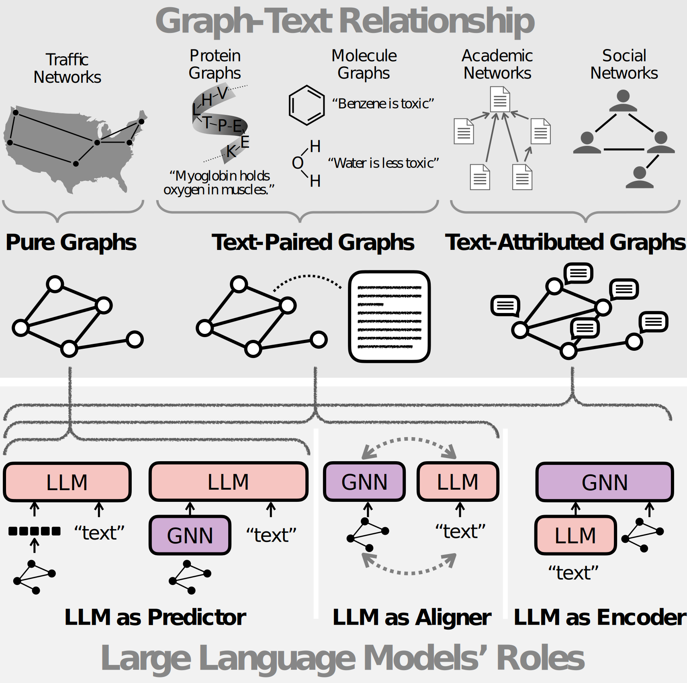

# Awesome-Language-Model-on-Graphs [](https://awesome.re)

A curated list of papers and resources about large language models (LLMs) on graphs based on our survey paper: [Large Language Models on Graphs: A Comprehensive Survey](https://arxiv.org/abs/2312.02783). 

**This repo will be continuously updated. Don't forget to star  it and keep tuned!**

**Please cite the paper in [Citations](#citations) if you find the resource helpful for your research. Thanks!**

<p align="center">
    
</p>

## Why LLMs on graphs?

Large language models (LLMs), such as ChatGPT and LLaMA, are creating significant advancements in natural language processing, due to their strong text encoding/decoding ability and newly found emergent capability (e.g., reasoning).
While LLMs are mainly designed to process pure texts, there are many real-world scenarios where text data are associated with rich structure information in the form of graphs (e.g., academic networks, and e-commerce networks) or scenarios where graph data are captioned with rich textual information (e.g., molecules with descriptions).
Besides, although LLMs have shown their pure text-based reasoning ability, it is underexplored whether such ability can be generalized to graph scenarios (i.e., graph-based reasoning).
In this paper, we provide a comprehensive review of scenarios and techniques related to large language models on graphs.

## Contents

- [Awesome-Language-Model-on-Graphs ](#awesome-language-model-on-graphs-)
  - [Why LLMs on graphs?](#why-llms-on-graphs)
  - [Contents](#contents)
    - [Keywords Convention](#keywords-convention)
  - [Perspectives](#perspectives)
  - [Pure Graphs](#pure-graphs)
    - [Datasets](#datasets)
    - [Direct Answering](#-direct-answering)
    - [Heuristic Reasoning](#-heuristic-reasoning)
    - [Algorithmic Reasoning](#-algorithmic-reasoning)
  - [Text-Attributed Graphs](#text-attributed-graphs)
    - [Datasets](#datasets-1)
    - [LLM as Predictor (Node)](#-llm-as-predictor-node)
      - [Graph As Sequence (Node)](#graph-as-sequence-node)
      - [Graph-Empowered LLM (Node)](#graph-empowered-llm-node)
      - [Graph-Aware LLM Finetuning](#graph-aware-llm-finetuning)
    - [LLM as Encoder](#-llm-as-encoder)
      - [Optimization](#optimization)
      - [Data Augmentation](#data-augmentation)
      <!-- - [Knowledge Distillation](#knowledge-distillation) -->
      - [Efficiency](#efficiency)
    - [LLM as Aligner (Node)](#-llm-as-aligner-node)
      - [Prediction Alignment](#prediction-alignment)
      - [Latent Space Alignment (Node)](#latent-space-alignment-node)
  - [Text-Paired Graphs (Molecules)](#text-paired-graphs-molecules)
    - [Datasets](#datasets-2)
    - [LLM as Predictor (Graph)](#-llm-as-predictor-graph)
      - [Graph As Sequence](#graph-as-sequence)
      - [Graph-Empowered LLM (Graph)](#graph-empowered-llm-graph)
    - [LLM as Aligner (Graph)](#-llm-as-aligner-graph)
      - [Latent Space Alignment (Graph)](#latent-space-alignment-graph)
  - [Contribution](#contribution)
  - [Citations](#citations)


### Keywords Convention

 The Transformer architecture used in the work, e.g., EncoderOnly, DecoderOnly, EncoderDecoder.

 The size of the large language model, e.g., medium (i.e., less than 1B parameters), LLM (i.e., more than 1B parameters).


## Perspectives
1. **Unifying Large Language Models and Knowledge Graphs: A Roadmap.** `preprint`

    *Shirui Pan, Linhao Luo, Yufei Wang, Chen Chen, Jiapu Wang, Xindong Wu* [[PDF](https://arxiv.org/pdf/2306.08302.pdf)], 2023.6

2. **Integrating Graphs with Large Language Models: Methods and Prospects** `preprint`
    
    *Shirui Pan, Yizhen Zheng, Yixin Liu* [[PDF](https://arxiv.org/pdf/2310.05499.pdf)], 2023.10

3. **Towards graph foundation models: A survey and beyond.** `preprint`

    *Jiawei Liu, Cheng Yang, Zhiyuan Lu, Junze Chen, Yibo Li, Mengmei Zhang, Ting Bai, Yuan Fang, Lichao Sun, Philip S. Yu, Chuan Shi.* [[PDF](https://arxiv.org/pdf/2310.11829.pdf)], 2023.10

4. **A Survey of Graph Meets Large Language Model: Progress and Future Directions.** `preprint`

    *Yuhan Li, Zhixun Li, Peisong Wang, Jia Li, Xiangguo Sun, Hong Cheng, Jeffrey Xu Yu.* [[PDF](https://arxiv.org/pdf/2311.12399.pdf)], 2023.11


## Pure Graphs

###  Datasets
Table 3 in our survey paper [Large Language Models on Graphs: A Comprehensive Survey](https://arxiv.org/abs/2312.02783).
<p align="center">
    
</p>


###  Direct Answering
1. **Can Language Models Solve Graph Problems in Natural Language?** `preprint`

    *Heng Wang, Shangbin Feng, Tianxing He, Zhaoxuan Tan, Xiaochuang Han, Yulia Tsvetkov.* [[PDF](https://browse.arxiv.org/pdf/2305.10037.pdf)] [[Code](https://github.com/Arthur-Heng/NLGraph)], 2023.5,  

2. **GPT4Graph: Can Large Language Models Understand Graph Structured Data ? An Empirical Evaluation and Benchmarking.** `preprint`

    *Jiayan Guo, Lun Du, Hengyu Liu, Mengyu Zhou, Xinyi He, Shi Han.* [[PDF](https://arxiv.org/abs/2305.15066)], 2023.5,  

3. **Evaluating Large Language Models on Graphs: Performance Insights and Comparative Analysis.** `preprint`

    *Chang Liu, Bo Wu.* [[PDF](https://arxiv.org/abs/2308.11224)] [[Code](https://github.com/Ayame1006/LLMtoGraph)], 2023.8, [[PDF](https://arxiv.org/abs/2305.15066)], 2023.5,  

4. **Talk Like A Graph: Encoding Graphs For Large Language Models.** `preprint`

    *Bahare Fatemi, Jonathan Halcrow, Bryan Perozzi.* [[PDF](https://arxiv.org/pdf/2310.04560.pdf)], 2023.10,  

5. **GraphLLM: Boosting Graph Reasoning Ability of Large Language Model.** `preprint`

    *Ziwei Chai, Tianjie Zhang, Liang Wu, Kaiqiao Han, Xiaohai Hu, Xuanwen Huang, Yang Yang.* [[PDF](https://arxiv.org/pdf/2310.05845.pdf)] [[Code](https://github.com/mistyreed63849/graph-llm)], 2023.10,  

6. **LLM4DyG: Can Large Language Models Solve Problems on Dynamic Graphs?.** `preprint`

    *Zeyang Zhang, Xin Wang, Ziwei Zhang, Haoyang Li, Yijian Qin, Simin Wu, Wenwu Zhu* [[PDF](https://arxiv.org/pdf/2310.17110.pdf)] [[Code]()], 2023.10,  

7. **Which Modality should I use - Text, Motif, or Image? : Understanding Graphs with Large Language Models.** `preprint`

    *Debarati Das, Ishaan Gupta, Jaideep Srivastava, Dongyeop Kang* [[PDF](https://arxiv.org/pdf/2311.09862.pdf)] [[Code]()], 2023.11,  

###  Heuristic Reasoning
1. **StructGPT: A General Framework for Large Language Model to Reason over Structured Data.** `preprint`

    *Jinhao Jiang, Kun Zhou, Zican Dong, Keming Ye, Wayne Xin Zhao, Ji-Rong Wen.* [[PDF](https://arxiv.org/abs/2305.09645)] [[Code](https://github.com/RUCAIBox/StructGPT)], 2023.5,  

2. **Think-on-Graph: Deep and Responsible Reasoning of Large Language Model on Knowledge Graph.** `preprint`

    *Jiashuo Sun, Chengjin Xu, Lumingyuan Tang, Saizhuo Wang, Chen Lin, Yeyun Gong, Lionel M. Ni, Heung-Yeung Shum, Jian Guo.* [[PDF](https://arxiv.org/abs/2307.07697)] [[Code](https://github.com/GasolSun36/ToG)], 2023.7,  

3. **Exploring Large Language Model for Graph Data Understanding in Online Job Recommendations.** `preprint`

    *Likang Wu, Zhaopeng Qiu, Zhi Zheng, Hengshu Zhu, Enhong Chen.* [[PDF](https://arxiv.org/abs/2307.05722)] [[Code](https://github.com/WLiK/GLRec)], 2023.7,  

4. **Knowledge Graph Prompting for Multi-Document Question Answering.** `AAAI2024`

    *Yu Wang, Nedim Lipka, Ryan Rossi, Alex Siu, Ruiyi Zhang, Tyler Derr.* [[PDF](https://arxiv.org/abs/2308.11730)] [[Code](https://github.com/YuWVandy/KG-LLM-MDQA)], 2023.8,  

5. **ChatRule: Mining Logical Rules with Large Language Models for Knowledge Graph Reasoning.** `preprint`

    *Linhao Luo, Jiaxin Ju, Bo Xiong, Yuan-Fang Li, Gholamreza Haffari, Shirui Pan.* [[PDF](https://arxiv.org/abs/2309.01538v3)] [[Code](https://github.com/RManLuo/ChatRule)], 2023.9,  

6. **Reasoning on Graphs: Faithful and Interpretable Large Language Model Reasoning.** `preprint`

    *Linhao Luo, Yuan-Fang Li, Gholamreza Haffari, Shirui Pan.* [[PDF](https://arxiv.org/abs/2310.01061)] [[Code](https://github.com/RManLuo/reasoning-on-graphs)], 2023.10,  

7. **Thought Propagation: An Analogical Approach to Complex Reasoning with Large Language Models.** `preprint`

    *Junchi Yu, Ran He, Rex Ying.* [[PDF](https://arxiv.org/abs/2310.03965)], 2023.10,  

8. **Large Language Models Can Learn Temporal Reasoning.** `preprint`

    *Siheng Xiong, Ali Payani, Ramana Kompella, Faramarz Fekri.* [[PDF](https://arxiv.org/abs/2401.06853)], 2024.1,  

9. **Exploring the Limitations of Graph Reasoning in Large Language Models.** `preprint`

    *Palaash Agrawal, Shavak Vasania, Cheston Tan.* [[PDF](https://arxiv.org/abs/2402.01805)], 2024.2,  

10. **Rendering Graphs for Graph Reasoning in Multimodal Large Language Models.** `preprint`

    *Yanbin Wei, Shuai Fu, Weisen Jiang, James T. Kwok, Yu Zhang.* [[PDF](https://arxiv.org/abs/2402.02130)], 2024.2,  

11. **Graph-enhanced Large Language Models in Asynchronous Plan Reasoning.** `preprint`

    *Fangru Lin, Emanuele La Malfa, Valentin Hofmann, Elle Michelle Yang, Anthony Cohn, Janet B. Pierrehumbert.* [[PDF](https://arxiv.org/abs/2402.02805)], 2024.2,  

12. **Microstructures and Accuracy of Graph Recall by Large Language Models.** `preprint`

    *Yanbang Wang, Hejie Cui, Jon Kleinberg.* [[PDF](https://arxiv.org/abs/2402.11821)], 2024.2,  

13. **Structure Guided Prompt: Instructing Large Language Model in Multi-Step Reasoning by Exploring Graph Structure of the Text.** `preprint`

    *Kewei Cheng, Nesreen K. Ahmed, Theodore Willke, Yizhou Sun.* [[PDF](https://arxiv.org/abs/2402.13415)], 2024.2,  

14. **GraphInstruct: Empowering Large Language Models with Graph Understanding and Reasoning Capability.** `preprint`

    *Zihan Luo, Xiran Song, Hong Huang, Jianxun Lian, Chenhao Zhang, Jinqi Jiang, Xing Xie, Hai Jin.* [[PDF](https://arxiv.org/abs/2403.04483)], 2024.3,  

15. **Call Me When Necessary: LLMs can Efficiently and Faithfully Reason over Structured Environments.** `preprint`

    *Sitao Cheng, Ziyuan Zhuang, Yong Xu, Fangkai Yang, Chaoyun Zhang, Xiaoting Qin, Xiang Huang, Ling Chen, Qingwei Lin, Dongmei Zhang, Saravan Rajmohan, Qi Zhang.* [[PDF](https://arxiv.org/abs/2403.08593)], 2024.3,  

16. **Exploring the Potential of Large Language Models in Graph Generation.** `preprint`

    *Yang Yao, Xin Wang, Zeyang Zhang, Yijian Qin, Ziwei Zhang, Xu Chu, Yuekui Yang, Wenwu Zhu, Hong Mei.* [[PDF](https://arxiv.org/abs/2403.14358)], 2024.3,  

###  Algorithmic Reasoning
1. **Graph-ToolFormer: To Empower LLMs with Graph Reasoning Ability via Prompt Augmented by ChatGPT.** `preprint`

    *Jiawei Zhang.* [[PDF](https://arxiv.org/abs/2304.11116)] [[Code](https://github.com/jwzhanggy/Graph_Toolformer)], 2023.4,  

2. **Graph Chain-of-Thought: Augmenting Large Language Models by Reasoning on Graphs.** `preprint`

    *Bowen Jin, Chulin Xie, Jiawei Zhang, Kashob Kumar Roy, Yu Zhang, Suhang Wang, Yu Meng, Jiawei Han.* [[PDF](https://arxiv.org/abs/2404.07103)] [[Code](https://github.com/PeterGriffinJin/Graph-CoT)] [[Data](https://huggingface.co/datasets/PeterJinGo/GRBench)], 2024.4,  

3. **From Local to Global: A Graph RAG Approach to Query-Focused Summarization.** `preprint`

    *Darren Edge, Ha Trinh, Newman Cheng, Joshua Bradley, Alex Chao, Apurva Mody, Steven Truitt, Jonathan Larson.* [[PDF](https://arxiv.org/abs/2404.16130)], 2024.4,  


## Text-Attributed Graphs

###  Datasets
Table 7 in our survey paper [Large Language Models on Graphs: A Comprehensive Survey](https://arxiv.org/abs/2312.02783).
<p align="center">
    
</p>

###  LLM as Predictor (Node)
#### Graph As Sequence (Node)
1. **MATCH: Metadata-Aware Text Classification in A Large Hierarchy.** `WWW 2021`

    *Yu Zhang, Zhihong Shen, Yuxiao Dong, Kuansan Wang, Jiawei Han.* [[PDF](https://arxiv.org/abs/2102.07349)] [[Code](https://github.com/yuzhimanhua/MATCH)], 2021.2,  

2. **QA-GNN: Reasoning with Language Models and Knowledge Graphs for Question Answering.** `NAACL 2021`

    *Michihiro Yasunaga, Hongyu Ren, Antoine Bosselut, Percy Liang, Jure Leskovec.* [[PDF](https://arxiv.org/abs/2104.06378)] [[Code](https://github.com/michiyasunaga/qagnn)], 2021.4,  

3. **Natural Language is All a Graph Needs.** `preprint`

    *Ruosong Ye, Caiqi Zhang, Runhui Wang, Shuyuan Xu, Yongfeng Zhang.* [[PDF](https://arxiv.org/abs/2308.07134)], 2023.8,  

4. **Can LLMs Effectively Leverage Graph Structural Information: When and Why.** `preprint`

    *Jin Huang, Xingjian Zhang, Qiaozhu Mei, Jiaqi Ma.* [[PDF](https://arxiv.org/abs/2309.16595)] [[Code](https://github.com/TRAIS-Lab/LLM-Structured-Data)], 2023.9,  
   
5. **Graph Neural Prompting with Large Language Models.** `preprint`

    *Yijun Tian, Huan Song, Zichen Wang, Haozhu Wang, Ziqing Hu, Fang Wang, Nitesh V. Chawla, Panpan Xu.* [[PDF](https://arxiv.org/abs/2309.15427)], 2023.9,  

6. **Prompt-based Node Feature Extractor for Few-shot Learning on Text-Attributed Graphs.** `preprint`

    *Xuanwen Huang, Kaiqiao Han, Dezheng Bao, Quanjin Tao, Zhisheng Zhang, Yang Yang, Qi Zhu.* [[PDF](https://arxiv.org/pdf/2309.02848.pdf)], 2023.9, ,  

7. **GraphText: Graph Reasoning in Text Space.** `preprint`
    
    *Jianan Zhao, Le Zhuo, Yikang Shen, Meng Qu, Kai Liu, Michael Bronstein, Zhaocheng Zhu, Jian Tang* [[PDF](https://arxiv.org/abs/2310.01089)], 2023.10,  

8. **GraphGPT: Graph Instruction Tuning for Large Language Models.** `preprint`

    *Jiabin Tang, Yuhao Yang, Wei Wei, Lei Shi, Lixin Su, Suqi Cheng, Dawei Yin, Chao Huang.* [[PDF](https://arxiv.org/pdf/2310.13023.pdf)], 2023.10,  

9. **Learning Multiplex Embeddings on Text-rich Networks with One Text Encoder.** `preprint`

    *Bowen Jin, Wentao Zhang, Yu Zhang, Yu Meng, Han Zhao, Jiawei Han.* [[PDF](https://arxiv.org/abs/2310.06684)][[Code]](https://github.com/PeterGriffinJin/METERN-submit), 2023.10,  

10. **Disentangled Representation Learning with Large Language Models for Text-Attributed Graphs.** `preprint`

    *Yijian Qin, Xin Wang, Ziwei Zhang, Wenwu Zhu.* [[PDF](https://arxiv.org/pdf/2310.18152.pdf)], 2023.10,  

11. **ReasoningLM: Enabling Structural Subgraph Reasoning in Pre-trained Language Models for Question Answering over Knowledge Graph.** `EMNLP23`

    *Jinhao Jiang, Kun Zhou, Wayne Xin Zhao, Yaliang Li, Ji-Rong Wen.* [[PDF](https://arxiv.org/abs/2401.00158)], 2023.12,  

12. **Chain of History: Learning and Forecasting with LLMs for Temporal Knowledge Graph Completion.** `preprint`

    *Ruilin Luo, Tianle Gu, Haoling Li, Junzhe Li, Zicheng Lin, Jiayi Li, Yujiu Yang.* [[PDF](https://arxiv.org/pdf/2401.06072)] [[Code](https://arxiv.org/abs/2401.06072)], 2024.1,  

13. **Scalable Link Prediction on Large-Scale Heterogeneous Graphs with Large Language Models.** `preprint`

    *Baolong Bi, Shenghua Liu, Yiwei Wang, Lingrui Mei, Xueqi Chen.* [[PDF](https://arxiv.org/abs/2401.13227)], 2024.1,  

14. **Similarity-based Neighbor Selection for Graph LLMs.** `preprint`

    *Rui Li, Jiwei Li, Jiawei Han, Guoyin Wang.* [[PDF](https://arxiv.org/abs/2402.03720)], 2024.2,  

15. **Let Your Graph Do the Talking: Encoding Structured Data for LLMs.** `preprint`

    *Bryan Perozzi, Bahare Fatemi, Dustin Zelle, Anton Tsitsulin, Mehran Kazemi, Rami Al-Rfou, Jonathan Halcrow.* [[PDF](https://arxiv.org/abs/2402.05862)], 2024.2,  

16. **InstructGraph: Boosting Large Language Models via Graph-centric Instruction Tuning and Preference Alignment.** `preprint`

    *Jianing Wang, Junda Wu, Yupeng Hou, Yao Liu, Ming Gao, Julian McAuley.* [[PDF](https://arxiv.org/abs/2402.08785)], 2024.2,  

17. **Graph Neural Network Enhanced Retrieval for Question Answering of LLMs.** `preprint`

    *Zijian Li, Qingyan Guo, Jiawei Shao, Lei Song, Jiang Bian, Jun Zhang, Rui Wang.* [[PDF](https://arxiv.org/abs/2406.06572)], 2024.6,  

#### Graph-Empowered LLM (Node)

1. **Text Generation from Knowledge Graphs with Graph Transformers.** `NAACL 2019`

    *Rik Koncel-Kedziorski, Dhanush Bekal, Yi Luan, Mirella Lapata, Hannaneh Hajishirzi.* [[PDF](https://arxiv.org/abs/1904.02342)] [[Code](https://github.com/rikdz/GraphWriter)], 2019.4,  

2. **GraphFormers: GNN-nested Transformers for Representation Learning on Textual Graph.** `NeurIPs 2021`

    *Junhan Yang, Zheng Liu, Shitao Xiao, Chaozhuo Li, Defu Lian, Sanjay Agrawal, Amit Singh, Guangzhong Sun, Xing Xie.* [[PDF](https://arxiv.org/abs/2105.02605)][[Code]](https://github.com/microsoft/GraphFormers), 2021.5,  

3. **GreaseLM: Graph Reasoning Enhanced Language Models for Question Answering.** `ICLR 2022`

    *Xikun Zhang, Antoine Bosselut, Michihiro Yasunaga, Hongyu Ren, Percy Liang, Christopher D Manning and Jure Leskovec.* [[PDF](https://cs.stanford.edu/~myasu/papers/greaselm_iclr22.pdf)] [[Code](https://github.com/snap-stanford/GreaseLM)], 2022.1,  

4. **Heterformer: Transformer-based Deep Node Representation Learning on Heterogeneous Text-Rich Networks.** `KDD 2023`

    *Bowen Jin, Yu Zhang, Qi Zhu, Jiawei Han.* [[PDF](https://arxiv.org/abs/2205.10282)][[Code]](https://github.com/PeterGriffinJin/Heterformer), 2022.5,  

5. **Hidden Schema Networks.** `preprint`

    *Ramsés J. Sánchez, Lukas Conrads, Pascal Welke, Kostadin Cvejoski, César Ojeda.* [[PDF](https://arxiv.org/abs/2207.03777)], 2022.7,  

6. **DRAGON: Deep Bidirectional Language-Knowledge Graph Pretraining.** `NeurIPs 2022`

    *Michihiro Yasunaga, Antoine Bosselut, Hongyu Ren, Xikun Zhang, Christopher D. Manning, Percy Liang, Jure Leskovec.* [[PDF](https://cs.stanford.edu/~myasu/papers/dragon_neurips22.pdf)][[Code]](https://github.com/michiyasunaga/dragon), 2022.10,  

7. **Edgeformers: Graph-Empowered Transformers for Representation Learning on Textual-Edge Networks.** `ICLR 2023`

    *Bowen Jin, Yu Zhang, Yu Meng, Jiawei Han.* [[PDF](https://openreview.net/pdf?id=2YQrqe4RNv)][[Code]](https://github.com/PeterGriffinJin/Edgeformers), 2023.1,  

8. **Patton: Language Model Pretraining on Text-rich Networks.** `ACL 2023`

    *Bowen Jin, Wentao Zhang, Yu Zhang, Yu Meng, Xinyang Zhang, Qi Zhu, Jiawei Han.* [[PDF](https://arxiv.org/abs/2305.12268)][[Code]](https://github.com/PeterGriffinJin/Patton), 2023.5,  

9. **Graph Language Models.** `preprint`

    *Moritz Plenz, Anette Frank.* [[PDF](https://arxiv.org/abs/2401.07105)], 2024.1,  

10. **Efficient Tuning and Inference for Large Language Models on Textual Graphs.** `preprint`

    *Yun Zhu, Yaoke Wang, Haizhou Shi, Siliang Tang.* [[PDF](https://arxiv.org/abs/2401.15569)], 2024.1,  

11. **HyperBERT: Mixing Hypergraph-Aware Layers with Language Models for Node Classification on Text-Attributed Hypergraphs.** `preprint`

    *Adrián Bazaga, Pietro Liò, Gos Micklem.* [[PDF](https://arxiv.org/abs/2402.07309)], 2024.2,  


#### Graph-Aware LLM Finetuning

1. **Explaining Relationships Between Scientific Documents.** `ACL 2021`

    *Kelvin Luu, Xinyi Wu, Rik Koncel-Kedziorski, Kyle Lo, Isabel Cachola, Noah A. Smith.* [[PDF](https://arxiv.org/abs/2002.00317)], 2020.2,  

2. **SPECTER: Document-level Representation Learning using Citation-informed Transformers.** `ACL 2020`

    *Arman Cohan, Sergey Feldman, Iz Beltagy, Doug Downey, Daniel S. Weld.* [[PDF](https://arxiv.org/abs/2004.07180)], 2020.4,  

3. **Pre-training for Ad-hoc Retrieval: Hyperlink is Also You Need.** `CIKM 2021`

    *Zhengyi Ma, Zhicheng Dou, Wei Xu, Xinyu Zhang, Hao Jiang, Zhao Cao, Ji-Rong Wen.* [[PDF](https://arxiv.org/abs/2108.09346)] [[Code](https://github.com/zhengyima/anchors)], 2021.8,  


4. **Neighborhood Contrastive Learning for Scientific Document Representations with Citation Embeddings.** `EMNLP 2022`

    *Malte Ostendorff, Nils Rethmeier, Isabelle Augenstein, Bela Gipp, Georg Rehm.* [[PDF](https://arxiv.org/pdf/2202.06671.pdf)][[Code]](https://github.com/malteos/scincl), 2022.2,  

5. **Metadata-Induced Contrastive Learning for Zero-Shot Multi-Label Text Classification.** `WWW 2022`

    *Yu Zhang, Zhihong Shen, Chieh-Han Wu, Boya Xie, Junheng Hao, Ye-Yi Wang, Kuansan Wang, Jiawei Han.* [[PDF](https://yuzhimanhua.github.io/papers/www22zhang.pdf)][[Code](https://github.com/yuzhimanhua/MICoL)], 2022.2,  

6. **LinkBERT: Pretraining Language Models with Document Links.** `ACL 2022`

    *Michihiro Yasunaga, Jure Leskovec, Percy Liang.* [[PDF](https://arxiv.org/pdf/2203.15827.pdf)][[Code]](https://github.com/michiyasunaga/LinkBERT), 2022.3,  

7. **E2EG: End-to-End Node Classification Using Graph Topology and Text-based Node Attributes.** `ICDM 2023`

    *Tu Anh Dinh, Jeroen den Boef, Joran Cornelisse, Paul Groth.* [[PDF](https://arxiv.org/pdf/2208.04609.pdf)], 2022.8,  

8. **TwHIN-BERT: A Socially-Enriched Pre-trained Language Model for Multilingual Tweet Representations at Twitter.** `KDD 2023`

    *Xinyang Zhang, Yury Malkov, Omar Florez, Serim Park, Brian McWilliams, Jiawei Han, Ahmed El-Kishky.* [[PDF](https://arxiv.org/abs/2209.07562)] [[Code](https://github.com/xinyangz/TwHIN-BERT)], 2022.9,  

9. **TouchUp-G: Improving Feature Representation through Graph-Centric Finetuning.** `preprint`

    *Jing Zhu, Xiang Song, Vassilis N. Ioannidis, Danai Koutra, Christos Faloutsos.* [[PDF](https://arxiv.org/abs/2309.13885)], 2023.9,  

10. **Wikiformer: Pre-training with Structured Information of Wikipedia for Ad-hoc Retrieval.** `preprint`

    *Weihang Su, Qingyao Ai, Xiangsheng Li, Jia Chen, Yiqun Liu, Xiaolong Wu, Shengluan Hou.* [[PDF](https://arxiv.org/abs/2312.10661)], 2023.12,  

11. **WalkLM: A Uniform Language Model Fine-tuning Framework for Attributed Graph Embedding.** `NeurIPs 2023`

    *Yanchao Tan, Zihao Zhou, Hang Lv, Weiming Liu, Carl Yang.* [[PDF](https://openreview.net/pdf?id=ZrG8kTbt70)], 2023.12,  

12. **GLaM: Fine-Tuning Large Language Models for Domain Knowledge Graph Alignment via Neighborhood Partitioning and Generative Subgraph Encoding.** `AAAI 2024`

    *Stefan Dernbach, Khushbu Agarwal, Alejandro Zuniga, Michael Henry, Sutanay Choudhury.* [[PDF](https://arxiv.org/abs/2402.06764)], 2024.2,  

13. **UniGLM: Training One Unified Language Model for Text-Attributed Graphs.** `preprint 2024`

    *Yi Fang, Dongzhe Fan, Sirui Ding, Ninghao Liu, Qiaoyu Tan.* [[PDF](https://arxiv.org/abs/2406.12052)], 2024.6,  

###  LLM as Encoder
#### Optimization

1. **GNN-LM: Language Modeling based on Global Contexts via GNN.** `ICLR 2022`

    *Yuxian Meng, Shi Zong, Xiaoya Li, Xiaofei Sun, Tianwei Zhang, Fei Wu, Jiwei Li.* [[PDF](https://arxiv.org/abs/2110.08743)] [[Code](https://github.com/ShannonAI/GNN-LM)], 2021.10,  

2. **Node Feature Extraction by Self-Supervised Multi-Scale Neighborhood Prediction.** `ICLR 2022`

    *Eli Chien, Wei-Cheng Chang, Cho-Jui Hsieh, Hsiang-Fu Yu, Jiong Zhang, Olgica Milenkovic, Inderjit S Dhillon.* [[PDF](https://arxiv.org/pdf/2111.00064.pdf)][[Code](https://github.com/amzn/pecos/tree/mainline/examples/giant-xrt)], 2021.11,  

3. **TextGNN: Improving Text Encoder via Graph Neural Network in Sponsored Search.** `WWW 2021`

    *Jason Yue Zhu, Yanling Cui, Yuming Liu, Hao Sun, Xue Li, Markus Pelger, Tianqi Yang, Liangjie Zhang, Ruofei Zhang, Huasha Zhao.* [[PDF](https://arxiv.org/pdf/2101.06323.pdf)] [[Code](https://github.com/microsoft/TextGNN)], 2022.1

4. **AdsGNN: Behavior-Graph Augmented Relevance Modeling in Sponsored Search.** `SIGIR 2021`

    *Chaozhuo Li, Bochen Pang, Yuming Liu, Hao Sun, Zheng Liu, Xing Xie, Tianqi Yang, Yanling Cui, Liangjie Zhang, Qi Zhang.* [[PDF](https://arxiv.org/pdf/2104.12080.pdf)] [[Code]()], 2022.4

5. **Efficient and effective training of language and graph neural network models.** `AAAI 2023`

    *Vassilis N Ioannidis, Xiang Song, Da Zheng, Houyu Zhang, Jun Ma, Yi Xu, Belinda Zeng, Trishul Chilimbi, George Karypis.* [[PDF](https://arxiv.org/abs/2206.10781)], 2022.6,  

6. **Graph-Aware Language Model Pre-Training on a Large Graph Corpus Can Help Multiple Graph Applications.** `KDD 2023`

    *Han Xie, Da Zheng, Jun Ma, Houyu Zhang, Vassilis N. Ioannidis, Xiang Song, Qing Ping, Sheng Wang, Carl Yang, Yi Xu, Belinda Zeng, Trishul Chilimbi.* [[PDF](https://arxiv.org/pdf/2306.02592.pdf)], 2023.6,  

7. **Exploring the Potential of Large Language Models (LLMs) in Learning on Graphs.** `preprint`

    *Zhikai Chen, Haitao Mao, Hang Li, Wei Jin, Hongzhi Wen, Xiaochi Wei, Shuaiqiang Wang, Dawei Yin, Wenqi Fan, Hui Liu, Jiliang Tang.* [[PDF](https://arxiv.org/abs/2307.03393)] [[Code](https://github.com/CurryTang/Graph-LLM)], 2023.7,   

8. **SimTeG: A Frustratingly Simple Approach Improves Textual Graph Learning.** `preprint`

    *Keyu Duan, Qian Liu, Tat-Seng Chua, Shuicheng Yan, Wei Tsang Ooi, Qizhe Xie, Junxian He.* [[PDF](https://arxiv.org/pdf/2308.02565.pdf)] [[Code](https://github.com/vermouthdky/SimTeG)], 2023.8,  


#### Data Augmentation
1. **Explanations as Features: LLM-Based Features for Text-Attributed Graphs.** `preprint`

    *Xiaoxin He, Xavier Bresson, Thomas Laurent, Adam Perold, Yann LeCun, Bryan Hooi.* [[PDF](https://arxiv.org/pdf/2305.19523.pdf)] [[Code](https://github.com/XiaoxinHe/TAPE)], 2023.5,   

2. **Label-free Node Classification on Graphs with Large Language Models (LLMS).** `preprint`

    *Zhikai Chen, Haitao Mao, Hongzhi Wen, Haoyu Han, Wei Jin, Haiyang Zhang, Hui Liu, Jiliang Tang.* [[PDF](https://arxiv.org/pdf/2310.04668.pdf)], 2023.9,  

3. **Empower Text-Attributed Graphs Learning with Large Language Models (LLMs).** `preprint`

    *Jianxiang Yu, Yuxiang Ren, Chenghua Gong, Jiaqi Tan, Xiang Li, Xuecang Zhang.* [[PDF](https://arxiv.org/pdf/2310.09872.pdf)], 2023.10,  

4. **Large Language Models as Topological Structure Enhancers for Text-Attributed Graphs.** `preprint`

    *Shengyin Sun, Yuxiang Ren, Chen Ma, Xuecang Zhang.* [[PDF](https://arxiv.org/pdf/2311.14324.pdf)], 2023.11,  

5.  **A Comprehensive Study on Text-attributed Graphs: Benchmarking and Rethinking.** `NeurIPS 2023`  
   
    *Hao Yan, Chaozhuo Li, Ruosong Long, Chao Yan, Jianan Zhao, Wenwen Zhuang, Jun Yin, Peiyan Zhang, Weihao Han, Hao Sun, Weiwei Deng, Qi Zhang, Lichao Sun, Xing Xie, Senzhang Wang* [[PDF](https://openreview.net/pdf?id=m2mbfoSuJ1)] [[Code](https://github.com/sktsherlock/TAG-Benchmark)], 2023.11,  

6. **Distilling Event Sequence Knowledge From Large Language Models.** `preprint`

    *Somin Wadhwa, Oktie Hassanzadeh, Debarun Bhattacharjya, Ken Barker, Jian Ni.* [[PDF](https://arxiv.org/abs/2401.07237)], 2024.1,  

7. **Don't Forget to Connect! Improving RAG with Graph-based Reranking.** `preprint`

    *Jialin Dong, Bahare Fatemi, Bryan Perozzi, Lin F. Yang, Anton Tsitsulin.* [[PDF](https://arxiv.org/abs/2405.18414)], 2024.5,  

#### Efficiency
1. **Train Your Own GNN Teacher: Graph-Aware Distillation on Textual Graphs.** `PKDD 2023`

    *C. Mavromatis, V. N. Ioannidis, S. Wang, D. Zheng, S. Adeshina, J. Ma, H. Zhao, C. Faloutsos, G. Karypis.* [[PDF](https://arxiv.org/abs/2304.10668)], 2023.4,  

2. **Efficient Large Language Models Fine-Tuning On Graphs.** `preprint`

    *Rui Xue, Xipeng Shen, Ruozhou Yu, Xiaorui Liu.* [[PDF](https://arxiv.org/abs/2312.04737)], 2023.12,  

3. **Distilling Large Language Models for Text-Attributed Graph Learning.** `preprint`

    *Bo Pan, Zheng Zhang, Yifei Zhang, Yuntong Hu, Liang Zhao.* [[PDF](https://arxiv.org/abs/2402.12022)], 2024.2,  

4. **Parameter-Efficient Tuning Large Language Models for Graph Representation Learning.** `preprint`

    *Qi Zhu, Da Zheng, Xiang Song, Shichang Zhang, Bowen Jin, Yizhou Sun, George Karypis.* [[PDF](https://arxiv.org/abs/2404.18271)], 2024.4,  

5. **Bridging Local Details and Global Context in Text-Attributed Graphs.** `preprint`

    *Yaoke Wang, Yun Zhu, Wenqiao Zhang, Yueting Zhuang, Yunfei Li, Siliang Tang.* [[PDF](https://arxiv.org/abs/2406.12608)], 2024.6,  


###  LLM as Aligner (Node)
#### Prediction Alignment

1. **Minimally-Supervised Structure-Rich Text Categorization via Learning on Text-Rich Networks.** `WWW 2021`

    *Xinyang Zhang, Chenwei Zhang, Luna Xin Dong, Jingbo Shang, Jiawei Han.* [[PDF](https://arxiv.org/abs/2102.11479)] [[Code](https://github.com/xinyangz/ltrn)], 2021.2,  

2. **Learning on Large-scale Text-attributed graphs via variational inference.** `ICLR 2023`

    *Jianan Zhao, Meng Qu, Chaozhuo Li, Hao Yan, Qian Liu, Rui Li, Xing Xie, Jian Tang.* [[PDF](https://openreview.net/pdf?id=q0nmYciuuZN)][[Code](https://github.com/AndyJZhao/GLEM)], 2023.1,  


#### Latent Space Alignment (Node)

1. **ConGraT: Self-Supervised Contrastive Pretraining for Joint Graph and Text Embeddings.** `preprint`

    *William Brannon, Suyash Fulay, Hang Jiang, Wonjune Kang, Brandon Roy, Jad Kabbara, Deb Roy.* [[PDF](https://arxiv.org/abs/2305.14321)] [[Code](https://github.com/wwbrannon/congrat)], 2023.5,  

2. **Augmenting Low-Resource Text Classification with Graph-Grounded Pre-training and Prompting.** `SIGIR 2023`

    *Zhihao Wen, Yuan Fang.* [[PDF](https://arxiv.org/abs/2305.03324)], 2023.5,  

3. **GRENADE: Graph-Centric Language Model for Self-Supervised Representation Learning on Text-Attributed Graphs.** `EMNLP 2023`

    *Yichuan Li, Kaize Ding, Kyumin Lee.* [[PDF](https://arxiv.org/abs/2310.15109)][[Code]](https://github.com/bigheiniu/GRENADE), 2023.10,  

4. **Pretraining Language Models with Text-Attributed Heterogeneous Graphs.** `preprint`

    *Tao Zou, Le Yu, Yifei HUANG, Leilei Sun, Bowen Du.* [[PDF](https://arxiv.org/pdf/2310.12580.pdf)] [[Code](https://github.com/Hope-Rita/THLM)], 2023.10,  


## Text-Paired Graphs (Molecules)

###  Datasets
Table 8 in our survey paper [Large Language Models on Graphs: A Comprehensive Survey](https://arxiv.org/abs/2312.02783).
<p align="center">
    
</p>

###  LLM as Predictor (Graph)
#### Graph As Sequence


1. **SMILES-BERT: Large Scale Unsupervised Pre-Training for Molecular Property Prediction** `BCB 19`
    
    *Sheng Wang , Yuzhi Guo , Yuhong Wang , Hongmao Sun , Junzhou Huang* [[PDF](https://par.nsf.gov/servlets/purl/10168888)] [[Code](https://github.com/uta-smile/SMILES-BERT)], 2019.09,  

2. **MolGPT: Molecular Generation Using a Transformer-Decoder Model.** `Journal of Chemical Information and Modeling`
    
    *Viraj Bagal, Rishal Aggarwal, P. K. Vinod, and U. Deva Priyakumar* [[PDF](https://pubs.acs.org/doi/10.1021/acs.jcim.1c00600)] [[Code](https://github.com/devalab/molgpt)], 2021.10, , 

3. **A Deep-learning System Bridging Molecule Structure and Biomedical Text with Comprehension Comparable to Human Professionals.** `Nature Communications`
    
    *Zheni Zeng, Yuan Yao, Zhiyuan Liu, Maosong Sun* [[PDF](https://www.nature.com/articles/s41467-022-28494-3)] [[Code](https://github.com/thunlp/KV-PLM)], 2022.02,  

4. **Chemformer: a pre-trained transformer for computational chemistry** `Machine Learning: Science and Technology`
    
    *Ross Irwin, Spyridon Dimitriadis, Jiazhen He and Esben Jannik Bjerrum* [[PDF](https://iopscience.iop.org/article/10.1088/2632-2153/ac3ffb/meta)] [[Code](https://github.com/MolecularAI/Chemformer)], 2022.02,  

5. **Large-Scale Distributed Training of Transformers for Chemical Fingerprinting.** `Journal of Chemical Information and Modeling`
    
    *Hisham Abdel-Aty, Ian R. Gould* [[PDF](https://pubs.acs.org/doi/full/10.1021/acs.jcim.2c00715)] [[Code](https://github.com/GouldGroup/MFBERT)], 2022.06,  

6. **Galactica: A Large Language Model for Science** `Preprint`
    
    *Ross Taylor, Marcin Kardas, Guillem Cucurull, Thomas Scialom, Anthony Hartshorn, Elvis Saravia, Andrew Poulton, Viktor Kerkez, Robert Stojnic* [[PDF](https://arxiv.org/pdf/2211.09085)] [[Code](https://github.com/paperswithcode/galai)], 2022.11,  

7. **Translation between Molecules and Natural Language.** `EMNLP 2022`
    
    *Carl Edwards, Tuan Lai, Kevin Ros, Garrett Honke, Kyunghyun Cho, Heng Ji.* [[PDF](https://arxiv.org/pdf/2204.11817.pdf)] [[Code](https://github.com/blender-nlp/MolT5)], 2022.12,  

8.  **Unifying Molecular and Textual Representations via Multi-task Language Modelling** `ICML 2023`
    
    *Dimitrios Christofidellis, Giorgio Giannone, Jannis Born, Ole Winther, Teodoro Laino, Matteo Manica* [[PDF](https://arxiv.org/pdf/2301.12586.pdf)] [[Code](https://github.com/gt4sd/multitask_text_and_chemistry_t5)], 2023.05,  

9.  **What can Large Language Models do in chemistry? A comprehensive benchmark on eight tasks.** `NeurIPS 2023`  
   
    *Taicheng Guo, Kehan Guo, Bozhao Nan, Zhenwen Liang, Zhichun Guo, Nitesh V. Chawla, Olaf Wiest, Xiangliang Zhang* [[PDF](https://arxiv.org/pdf/2305.18365.pdf)] [[Code](https://github.com/chemfoundationmodels/chemllmbench)], 2023.9,  

10. **MolXPT: Wrapping Molecules with Text for Generative Pre-training.** `ACL 2023`

    *Zequn Liu, Wei Zhang, Yingce Xia, Lijun Wu, Shufang Xie, Tao Qin, Ming Zhang, Tie-Yan Liu.* [[PDF](https://arxiv.org/pdf/2305.10688)], 2023.05,  


11. **Interactive Molecular Discovery with Natural Language** `preprint`
   
    *Zheni Zeng, Bangchen Yin, Shipeng Wang, Jiarui Liu, Cheng Yang, Haishen Yao, Xingzhi Sun, Maosong Sun, Guotong Xie, Zhiyuan Liu.* [[PDF](https://arxiv.org/pdf/2306.11976)] [[Code](https://github.com/JinyuanSun/ChatMol)], 2023.06,  

12. **Empowering Molecule Discovery for Molecule-Caption Translation with Large Language Models: A ChatGPT Perspective** `preprint`
   
    *Jiatong Li, Yunqing Liu, Wenqi Fan, Xiao-Yong Wei, Hui Liu, Jiliang Tang, Qing Li.* [[PDF](https://arxiv.org/pdf/2306.06615)], 2023.06, [[Code](https://github.com/phenixace/MolReGPT)],  

13. **Regression Transformer enables concurrent sequence regression and generation for molecular language modelling** `Nature Machine Intelligence`
   
    *Jannis Born, Matteo Manica* [[PDF](https://www.nature.com/articles/s42256-023-00639-z)] [[Code](https://github.com/IBM/regression-transformer)], 2023.6, , 

14. **Can Large Language Models Empower Molecular Property Prediction?** `preprint`
   
    *Chen Qian, Huayi Tang, Zhirui Yang, Hong Liang, Yong Liu.* [[PDF](https://browse.arxiv.org/pdf/2307.07443.pdf)] [[Code](https://github.com/ChnQ/LLM4Mol)], 2023.7,  

15. **Mol-Instructions: A Large-Scale Biomolecular Instruction Dataset for Large Language Models** `preprint`
   
    *Yin Fang, Xiaozhuan Liang, Ningyu Zhang, Kangwei Liu, Rui Huang, Zhuo Chen, Xiaohui Fan, Huajun Chen* [[PDF](https://arxiv.org/pdf/2306.08018)], 2023.07,  

16. **GPT-MolBERTa: GPT Molecular Features Language Model for molecular property prediction.** `preprint`
   
    *Balaji, Suryanarayanan, Rishikesh Magar, and Yayati Jadhav.* [[PDF](https://arxiv.org/pdf/2310.03030.pdf)], 2023.10,  

17. **The Impact of Large Language Models on Scientific Discovery: a Preliminary Study using GPT-4.** `preprint`

    *Microsoft Research AI4Science, Microsoft Azure Quantum* [[PDF](https://arxiv.org/abs/2311.07361)], 2023.11,  

18. **Towards 3D Molecule-Text Interpretation in Language Models** `ICLR 2024`

    *Sihang Li, Zhiyuan Liu, Yanchen Luo, Xiang Wang, Xiangnan He, Kenji Kawaguchi, Tat-Seng Chua, Qi Tian.* [[PDF](https://arxiv.org/abs/2401.13923)], 2024.1,  

19. **MolTC: Towards Molecular Relational Modeling In Language Models** `preprint`

    *Junfeng Fang, Shuai Zhang, Chang Wu, Zhengyi Yang, Zhiyuan Liu, Sihang Li, Kun Wang, Wenjie Du, Xiang Wang.* [[PDF](https://arxiv.org/abs/2402.03781)], 2024.2,  

20. **Large Language Models are In-Context Molecule Learners** `preprint`

    *Jiatong Li, Wei Liu, Zhihao Ding, Wenqi Fan, Yuqiang Li, Qing Li.* [[PDF](https://arxiv.org/abs/2403.04197)], 2024.3,  

#### Graph-Empowered LLM (Graph)

1. **Text2Mol: Cross-Modal Molecule Retrieval with Natural Language Queries.** `EMNLP 2021`
   
    *Carl Edwards, ChengXiang Zhai, Heng Ji.* [[PDF](https://aclanthology.org/2021.emnlp-main.47.pdf)] [[Code](https://github.com/cnedwards/text2mol)], 2021.10,  

2. **GIMLET: A Unified Graph-Text Model for Instruction-Based Molecule Zero-Shot Learning.** `preprint`
   
    *Haiteng Zhao, Shengchao Liu, Chang Ma, Hannan Xu, Jie Fu, Zhi-Hong Deng, Lingpeng Kong, Qi Liu.* [[PDF](https://arxiv.org/abs/2306.13089)] [[Code](https://github.com/zhao-ht/GIMLET)], 2023.6,  

3. **Prot2Text: Multimodal Protein's Function Generation with GNNs and Transformers** `preprint`
   
    *Hadi Abdine, Michail Chatzianastasis, Costas Bouyioukos, Michalis Vazirgiannis* [[PDF](https://arxiv.org/pdf/2307.14367)], 2023.07,  

4. **ReLM: Leveraging Language Models for Enhanced Chemical Reaction Prediction.** `EMNLP 2023`
   
    *Yaorui Shi, An Zhang, Enzhi Zhang, Zhiyuan Liu, Xiang Wang.* [[PDF](https://arxiv.org/pdf/2310.13590.pdf)] [[Code](https://github.com/syr-cn/relm)], 2023.10,  

5. **Biomedical knowledge graph-enhanced prompt generation for large language models** `preprint`

    *Karthik Soman, Peter W Rose, John H Morris, Rabia E Akbas, Brett Smith, Braian Peetoom, Catalina Villouta-Reyes, Gabriel Cerono, Yongmei Shi, Angela Rizk-Jackson, Sharat Israni, Charlotte A Nelson, Sui Huang, Sergio E Baranzini* [[PDF](https://arxiv.org/abs/2311.17330)] [[Code](https://github.com/BaranziniLab/KG_RAG)], 2023.11,  

6. **L+M-24: Building a Dataset for Language + Molecules @ ACL 2024** `preprint`

    *Carl Edwards, Qingyun Wang, Lawrence Zhao, Heng Ji* [[PDF](https://arxiv.org/abs/2403.00791)] [[Code](https://huggingface.co/language-plus-molecules)], 2024.2,  


###  LLM as Aligner (Graph)

#### Latent Space Alignment (Graph)

1.  **A Molecular Multimodal Foundation Model Associating Molecule Graphs with Natural Language.** `preprint`
   
    *Bing Su, Dazhao Du, Zhao Yang, Yujie Zhou, Jiangmeng Li, Anyi Rao, Hao Sun, Zhiwu Lu, Ji-Rong Wen* [[PDF](https://arxiv.org/pdf/2209.05481.pdf)] [[Code](https://github.com/bingsu12/momu)], 2022.09,  

2. **Multi-modal Molecule Structure-text Model for Text-based Retrieval and Editing.** `preprint`
   
    *Shengchao Liu, Weili Nie, Chengpeng Wang, Jiarui Lu, Zhuoran Qiao, Ling Liu, Jian Tang, Chaowei Xiao, Anima Anandkumar* [[PDF](https://arxiv.org/pdf/2212.10789.pdf)], 2022.10,  

3. **Extracting Molecular Properties from Natural Language with Multimodal Contrastive Learning** `ICML 2023 Workshop on Computational Biology`
   
    *Romain Lacombe, Andrew Gaut, Jeff He, David Lüdeke, Kateryna Pistunova* [[PDF](https://arxiv.org/pdf/2307.12996)], 2023.07,  

4. **ProtST: Multi-Modality Learning of Protein Sequences and Biomedical Texts.** `ICML 2023`

    *Minghao Xu, Xinyu Yuan, Santiago Miret, Jian Tang.* [[PDF](https://arxiv.org/pdf/2301.12040.pdf)] [[Code](https://github.com/DeepGraphLearning/ProtST)], 2023.1,  


5. **Enhancing Activity Prediction Models in Drug Discovery with the Ability to Understand Human Language.** `ICML 2023`

    *Philipp Seidl, Andreu Vall, Sepp Hochreiter, Günter Klambauer.* [[PDF](https://proceedings.mlr.press/v202/seidl23a/seidl23a.pdf)] [[Code](https://github.com/ml-jku/clamp)], 2023.5,  

6.  **MolFM: A multimodal molecular foundation model.** `Preprint`
   
    *Yizhen Luo, Kai Yang, Massimo Hong, Xing Yi Liu, Zaiqing Nie.* [[PDF](https://arxiv.org/pdf/2307.09484.pdf)] [[Code](https://github.com/PharMolix/OpenBioMed)], 2023.7,  

7. **GIT-Mol: A Multi-modal Large Language Model for Molecular Science with Graph, Image, and Text** `Preprint`
   
    *Pengfei Liu, Yiming Ren, Zhixiang Ren* [[PDF](https://arxiv.org/pdf/2308.06911)], 2023.08,  

8. **MolCA: Molecular Graph-Language Modeling with Cross-Modal Projector and Uni-Modal Adapter.** `EMNLP 2023`
   
    *Zhiyuan Liu, Sihang Li, Yanchen Luo, Hao Fei, Yixin Cao, Kenji Kawaguchi, Xiang Wang, Tat-Seng Chua.* [[PDF](https://arxiv.org/pdf/2310.12798v1.pdf)] [[Code](https://github.com/acharkq/MolCA)], 2023.10,  

9. **CHEMREASONER: Heuristic Search over a Large Language Model's Knowledge Space using Quantum-Chemical Feedback.** `preprint`
   
    *Henry W. Sprueill, Carl Edwards, Khushbu Agarwal, Mariefel V. Olarte, Udishnu Sanyal, Conrad Johnston, Hongbin Liu, Heng Ji, Sutanay Choudhury.* [[PDF](https://arxiv.org/abs/2402.10980)], 2024.2,  


## Contribution

Contributions to this repository are welcome!

If you find any error or have relevant resources, feel free to open an issue or a pull request.

Paper format:
```
1. **[paper title].** `[]`

    *[authors].* [[PDF]([pdf link])] [[Code]([code link])], published time,  
```

## Citations

Please cite the following paper if you find the resource helpful for your research.
```
@article{jin@llmgraph,
  title={Large Language Models on Graphs: A Comprehensive Survey},
  author={Jin, Bowen and Liu, Gang and Han, Chi and Jiang, Meng and Ji, Heng and Han, Jiawei},
  journal={arXiv preprint arXiv:2312.02783},
  year={2023}
}
```
